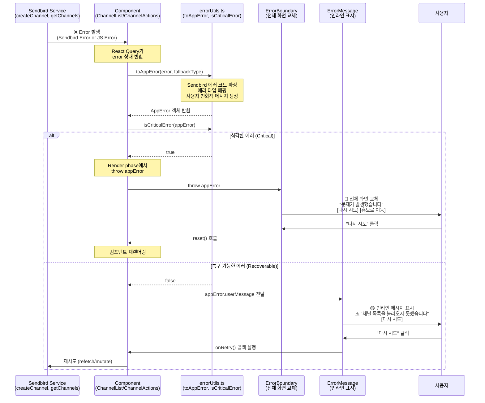
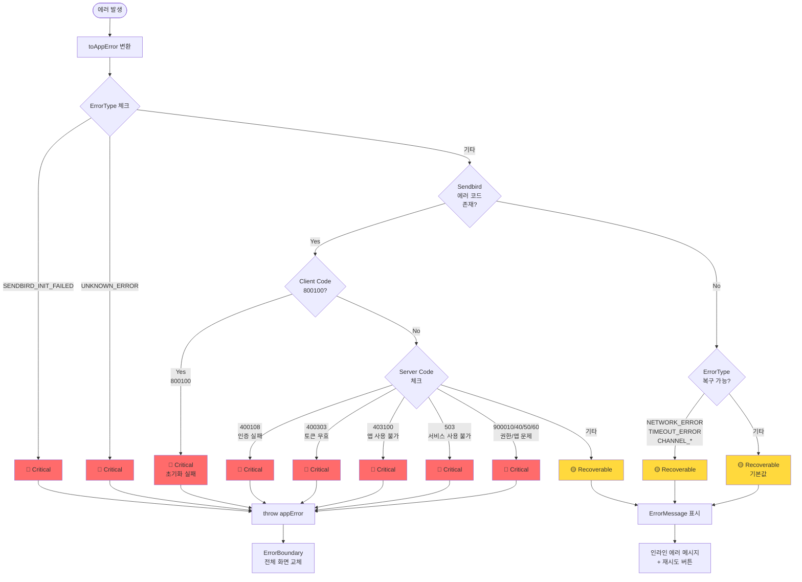
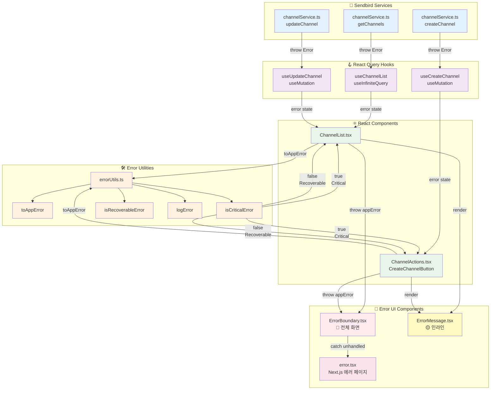
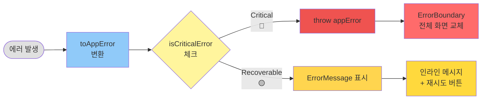

# 에러 처리 전략 문서

## 📋 개요

이 프로젝트는 **3단계 에러 처리 전략**을 사용하여 에러의 심각도에 따라 다르게 처리합니다.

- **심각한 에러 (Critical)**: ErrorBoundary로 전체 화면 교체
- **복구 가능한 에러 (Recoverable)**: ErrorMessage로 인라인 표시 + 재시도 버튼
- **서버 에러 (Server)**: Next.js error.tsx로 처리

---

## 🎯 3단계 에러 처리 전략

### 1️⃣ 심각한 에러 (Critical Errors) → ErrorBoundary

**특징**:

- 사용자가 재시도해도 해결되지 않는 에러
- ErrorBoundary가 전체 화면을 교체
- 페이지 새로고침 필요

**UI**:

```
┌─────────────────────────────────────┐
│           ⚠️                        │
│   문제가 발생했습니다                │
│                                     │
│   [사용자 친화적 메시지]             │
│                                     │
│   [다시 시도]  [홈으로 이동]         │
│                                     │
│   [개발자 정보] (개발 환경만)        │
└─────────────────────────────────────┘
```

**대상 에러**:

- 🔴 **Sendbird 초기화 실패** (`800100`)
  - `ErrorType.SENDBIRD_INIT_FAILED`
  - 메시지: "서비스 연결에 실패했습니다. 페이지를 새로고침해주세요."

- 🔴 **인증 실패** (`400108`, `400303`)
  - `SendbirdServerErrorCode.UNAUTHORIZED_REQUEST`
  - `SendbirdServerErrorCode.ACCESS_TOKEN_NOT_VALID`
  - 메시지: "인증에 실패했습니다."

- 🔴 **앱 사용 불가** (`403100`, `900040`, `900050`, `900060`)
  - `SendbirdServerErrorCode.APPLICATION_NOT_AVAILABLE`
  - `SendbirdServerErrorCode.REQUEST_FAILED_UNAPPROVED_APP`
  - `SendbirdServerErrorCode.REQUEST_FAILED_APP_DISABLED`
  - `SendbirdServerErrorCode.REQUEST_FAILED_APP_DELETED`
  - 메시지: "서비스를 사용할 수 없습니다."

- 🔴 **서비스 사용 불가** (`503`)
  - `SendbirdServerErrorCode.SERVICE_UNAVAILABLE`
  - 메시지: "서비스를 일시적으로 사용할 수 없습니다."

- 🔴 **권한 없음** (`900010`)
  - `SendbirdServerErrorCode.REQUEST_FAILED_UNAUTHORIZED`
  - 메시지: "권한이 없습니다."

- 🔴 **알 수 없는 에러**
  - `ErrorType.UNKNOWN_ERROR`
  - 메시지: "알 수 없는 오류가 발생했습니다."

**구현 위치**:

- `src/_lib/errorUtils.ts`: `isCriticalError()` 함수
- `src/app/_components/ErrorBoundary/ErrorBoundary.tsx`
- `src/app/error.tsx` (Next.js error page)
- `src/app/global-error.tsx` (Next.js global error page)

---

### 2️⃣ 복구 가능한 에러 (Recoverable Errors) → ErrorMessage

**특징**:

- 사용자가 재시도하면 해결될 수 있는 에러
- 인라인으로 ErrorMessage 컴포넌트 표시
- "다시 시도" 버튼 제공

**UI**:

```
┌─────────────────────────────────────┐
│   ⚠️ [사용자 친화적 메시지]          │
│   [다시 시도]                        │
└─────────────────────────────────────┘
```

**대상 에러**:

**네트워크 에러**:

- 🟡 `800120`: `NETWORK_ERROR` - "네트워크 연결을 확인해주세요."
- 🟡 `800121`: `NETWORK_ROUTING_ERROR` - "네트워크 연결이 불안정합니다."

**타임아웃**:

- 🟡 `800180`: `ACK_TIMEOUT` - "요청 시간이 초과되었습니다."
- 🟡 `800190`: `LOGIN_TIMEOUT` - "로그인 시간이 초과되었습니다. 다시 시도해주세요."

**Rate Limit**:

- 🟡 `800160`: `MARK_AS_READ_RATE_LIMIT_EXCEEDED` - "너무 많은 요청이 발생했습니다. 잠시 후 다시 시도해주세요."
- 🟡 `500910`: `RATE_LIMIT_EXCEEDED` - "요청 횟수가 초과되었습니다. 잠시 후 다시 시도해주세요."

**연결 에러**:

- 🟡 `800101`: `CONNECTION_REQUIRED` - "서버 연결이 필요합니다. 잠시 후 다시 시도해주세요."
- 🟡 `800102`: `CONNECTION_CANCELED` - "연결이 취소되었습니다."
- 🟡 `800200`: `WEBSOCKET_CONNECTION_CLOSED` - "서버 연결이 종료되었습니다."
- 🟡 `800210`: `WEBSOCKET_CONNECTION_FAILED` - "서버 연결에 실패했습니다."
- 🟡 `800220`: `REQUEST_FAILED` - "요청에 실패했습니다."

**채널 작업**:

- 🟡 `ErrorType.CHANNEL_FETCH_FAILED` - "채널 목록을 불러오지 못했습니다."
- 🟡 `ErrorType.CHANNEL_CREATE_FAILED` - "채널 생성에 실패했습니다."
- 🟡 `ErrorType.CHANNEL_UPDATE_FAILED` - "채널 수정에 실패했습니다."
- 🟡 `ErrorType.CHANNEL_NOT_FOUND` - "채널을 찾을 수 없습니다."

**리소스 없음**:

- 🟡 `400201`: `RESOURCE_NOT_FOUND` - "요청한 리소스를 찾을 수 없습니다."
- 🟡 `900200`: `REQUEST_FAILED_CHANNEL_NOT_FOUND` - "채널을 찾을 수 없습니다."

**구현 위치**:

- `src/_lib/errorUtils.ts`: `isRecoverableError()` 함수
- `src/app/_components/ErrorMessage/ErrorMessage.tsx`
- `src/app/_components/ChannelList/ChannelList.tsx`
- `src/app/_components/ChannelActions/ChannelActions.tsx`

---

### 3️⃣ 서버 에러 (Server Errors) → Next.js error.tsx

**특징**:

- Next.js Server Component에서 발생한 에러
- Next.js 공식 에러 페이지로 처리
- 루트 레벨 에러 캐치 (global-error.tsx)

**UI**: ErrorBoundary와 유사하지만 Next.js 최적화

**대상**:

- Next.js Server Component runtime 에러
- 예상치 못한 서버 크래시
- 기타 처리되지 않은 에러

**구현 위치**:

- `src/app/error.tsx`: 클라이언트 사이드 에러 캐치
- `src/app/global-error.tsx`: 루트 레벨 에러 캐치

---

## 🔧 구현 세부사항

### 에러 심각도 판단 함수

#### `isCriticalError(error: AppError): boolean`

**위치**: `src/_lib/errorUtils.ts:292`

**역할**: 에러가 심각한지 판단

**로직**:

1. ErrorType으로 먼저 판단
   - `SENDBIRD_INIT_FAILED` → Critical
   - `UNKNOWN_ERROR` → Critical

2. Sendbird 에러 코드로 판단 (code 필드가 있는 경우)
   - Client: `800100` (초기화 실패)
   - Server: `400108`, `400303`, `403100`, `503`, `900010`, `900040`, `900050`, `900060`

**사용 예시**:

```typescript
if (error) {
  const appError = toAppError(error, ErrorType.CHANNEL_FETCH_FAILED)

  if (isCriticalError(appError)) {
    throw appError // ErrorBoundary가 캐치
  }

  // 복구 가능한 에러 처리
  return <ErrorMessage message={appError.userMessage} onRetry={refetch} />
}
```

---

#### `isRecoverableError(error: AppError): boolean`

**위치**: `src/_lib/errorUtils.ts:344`

**역할**: 에러가 복구 가능한지 판단

**로직**:

1. 심각한 에러는 복구 불가능 → `false`
2. ErrorType으로 판단
   - `NETWORK_ERROR`, `TIMEOUT_ERROR` 등 → Recoverable
3. Sendbird 에러 코드로 판단
   - Client: `800101`, `800102`, `800120`, `800121`, `800160`, `800180`, `800190`, `800200`, `800210`, `800220`
   - Server: `400201`, `500910`, `900200`
4. 기타 에러는 복구 가능한 것으로 간주 (안전한 기본값)

---

### 컴포넌트별 에러 처리

#### ChannelList 컴포넌트

**위치**: `src/app/_components/ChannelList/ChannelList.tsx:71`

**에러 처리 로직**:

```typescript
// Render phase에서 에러 체크
if (error) {
  const appError = toAppError(error, ErrorType.CHANNEL_FETCH_FAILED)

  // 심각한 에러는 throw
  if (isCriticalError(appError)) {
    throw appError
  }

  // 복구 가능한 에러는 ErrorMessage 표시
  return (
    <S.ErrorContainer>
      <ErrorMessage
        message={appError.userMessage}
        onRetry={() => window.location.reload()}
      />
    </S.ErrorContainer>
  )
}
```

**재시도 방식**: 페이지 새로고침 (`window.location.reload()`)

---

#### ChannelActions 컴포넌트

**위치**: `src/app/_components/ChannelActions/ChannelActions.tsx:23`

**에러 처리 로직**:

```typescript
// Render phase에서 에러 체크
if (error) {
  const appError = toAppError(error, ErrorType.CHANNEL_CREATE_FAILED)

  // 심각한 에러는 throw
  if (isCriticalError(appError)) {
    throw appError
  }
}

// 복구 가능한 에러만 CreateChannelButton으로 전달
const errorMessage = error
  ? toAppError(error, ErrorType.CHANNEL_CREATE_FAILED).userMessage
  : undefined

return (
  <CreateChannelButton
    error={errorMessage}
    onRetry={handleRetry}
  />
)
```

**재시도 방식**: React Query mutation 재실행 (`reset()` + `mutate()`)

---

## 🧪 에러 테스트

### ErrorTester 컴포넌트 사용

**위치**: 개발 서버 실행 시 오른쪽 하단 패널

**사용 방법**:

```bash
npm run dev
# http://localhost:3000 접속
# 오른쪽 하단의 "🧪 Error Tester" 패널 확인
```

### 테스트 섹션

#### 섹션 1: ErrorBoundary 테스트 (심각한 에러)

- 초기화 실패 (800100)
- 인증 실패 (400108)
- 앱 사용 불가 (403100)
- 알 수 없는 에러

**결과**: ErrorBoundary가 화면 전체를 교체, 페이지 새로고침 필요

---

#### 섹션 2: 복구 가능한 에러

- 클라이언트 에러 (800xxx)
- 네트워크, 타임아웃, WebSocket 등

**결과**: 콘솔과 패널 하단에 결과 표시

---

#### 섹션 3: 서버 에러 시뮬레이션

- 서버 에러 (400xxx, 500xxx, 900xxx)
- 일부는 심각도에 따라 다르게 처리

**결과**: 콘솔과 패널 하단에 결과 표시

---

### 수동 테스트 방법

#### 1. 심각한 에러 테스트 (ErrorBoundary)

```typescript
// ErrorTester에서 "초기화 실패 (800100)" 버튼 클릭
// 또는 직접 throw
throw new AppError(
  ErrorType.SENDBIRD_INIT_FAILED,
  '서비스 연결에 실패했습니다.',
  'Sendbird initialization failed',
  null,
  800100
)
```

**예상 결과**:

- ErrorBoundary가 화면 교체
- "문제가 발생했습니다" 제목
- "서비스 연결에 실패했습니다." 메시지
- "다시 시도", "홈으로 이동" 버튼
- 개발 환경: 디버그 정보 표시 (Error Type, Code, Stack Trace)

---

#### 2. 복구 가능한 에러 테스트 (ErrorMessage)

```typescript
// ErrorTester에서 "800120: 네트워크 에러" 버튼 클릭
// 결과가 패널 하단에 표시됨
```

**예상 결과**:

- ErrorMessage 컴포넌트 표시 (⚠️ 아이콘)
- "네트워크 연결을 확인해주세요." 메시지
- "다시 시도" 버튼
- 콘솔에 에러 로그

---

#### 3. 채널 목록 에러 테스트

```bash
# .env.local에서 SENDBIRD_APP_ID를 잘못된 값으로 변경
# npm run dev 실행
# 채널 목록 로딩 실패 확인
```

**예상 결과**:

- ChannelList 영역에 ErrorMessage 표시
- "채널 목록을 불러오지 못했습니다." 메시지
- "다시 시도" 버튼 (클릭 시 페이지 새로고침)

---

#### 4. 채널 생성 에러 테스트

```typescript
// useCreateChannel에서 에러 발생 시뮬레이션
// mockCreateChannel.mockRejectedValue(new Error('Network error'))
```

**예상 결과**:

- CreateChannelButton 아래에 ErrorMessage 표시
- "채널 생성에 실패했습니다." 메시지
- "다시 시도" 버튼 (클릭 시 mutation 재실행)

---

## 📊 에러 플로우 다이어그램

### 1️⃣ 전체 에러 처리 시퀀스 다이어그램

서비스에서 에러가 발생했을 때부터 UI에 표시되기까지의 전체 흐름을 보여줍니다.



---

### 2️⃣ 에러 심각도 판단 플로우차트

`isCriticalError()` 함수의 판단 로직을 상세히 보여줍니다.



---

### 3️⃣ 컴포넌트 상호작용 다이어그램

컴포넌트들이 에러 유틸리티 및 에러 UI와 어떻게 상호작용하는지 보여줍니다.



---

### 4️⃣ 간단한 요약 다이어그램



---

## 🎨 사용자 경험 (UX)

### 심각한 에러 발생 시

1. ErrorBoundary가 화면 전체를 교체
2. 사용자에게 명확한 에러 메시지 표시 (한글)
3. "다시 시도" 버튼으로 복구 시도
4. "홈으로 이동" 버튼으로 안전한 페이지 이동
5. 개발 환경: 개발자가 디버깅 정보 확인 가능

### 복구 가능한 에러 발생 시

1. 작업 중인 화면 유지
2. 해당 영역에만 ErrorMessage 표시
3. 사용자에게 명확한 에러 메시지 표시 (한글)
4. "다시 시도" 버튼으로 즉시 재시도
5. 다른 기능은 정상 작동

---

## 💡 Best Practices

### 1. 에러 메시지는 항상 사용자 친화적으로

```typescript
// ❌ 나쁜 예
throw new Error('Network request failed')

// ✅ 좋은 예
throw new AppError(
  ErrorType.NETWORK_ERROR,
  '네트워크 연결을 확인해주세요.', // 사용자 친화적
  'Network request failed', // 기술적 메시지
  originalError
)
```

### 2. 에러 심각도 올바르게 판단

```typescript
// ❌ 나쁜 예: 복구 가능한 에러를 throw
if (error) {
  throw error // 항상 ErrorBoundary로
}

// ✅ 좋은 예: 심각도에 따라 다르게 처리
if (error) {
  const appError = toAppError(error, fallbackType)

  if (isCriticalError(appError)) {
    throw appError // 심각한 에러만 throw
  }

  // 복구 가능한 에러는 인라인 표시
  return <ErrorMessage message={appError.userMessage} onRetry={refetch} />
}
```

### 3. 재시도 기능 제공

```typescript
// ✅ 항상 재시도 버튼 제공
<ErrorMessage
  message={errorMessage}
  onRetry={handleRetry} // 재시도 콜백
/>
```

### 4. 에러 로깅

```typescript
// ✅ 에러 발생 시 항상 로깅
catch (error) {
  const appError = toAppError(error, ErrorType.CHANNEL_FETCH_FAILED)
  logError(appError, 'getChannels') // 컨텍스트 포함
  throw appError
}
```

### 5. Render phase에서 에러 체크

```typescript
// ❌ 나쁜 예: useEffect에서 throw (컴포넌트 언마운트)
useEffect(() => {
  if (error) {
    throw error // 컴포넌트가 사라짐
  }
}, [error])

// ✅ 좋은 예: Render phase에서 체크
if (error) {
  const appError = toAppError(error, fallbackType)
  if (isCriticalError(appError)) {
    throw appError // ErrorBoundary가 즉시 캐치
  }
}
```

---

## 🔗 관련 파일

### 핵심 파일

- `src/_types/error.types.ts`: AppError 클래스, ErrorType enum
- `src/_types/sendbirdError.types.ts`: Sendbird 에러 코드, 메시지 매핑
- `src/_lib/errorUtils.ts`: 에러 처리 유틸리티 (toAppError, isCriticalError, isRecoverableError, logError)

### 컴포넌트

- `src/app/_components/ErrorBoundary/ErrorBoundary.tsx`: React Error Boundary
- `src/app/_components/ErrorMessage/ErrorMessage.tsx`: 인라인 에러 메시지
- `src/app/_components/ErrorTester/ErrorTester.tsx`: 개발 환경 전용 에러 테스터

### Next.js 에러 페이지

- `src/app/error.tsx`: 클라이언트 사이드 에러 페이지
- `src/app/global-error.tsx`: 루트 레벨 에러 페이지

### 적용된 컴포넌트

- `src/app/_components/ChannelList/ChannelList.tsx`
- `src/app/_components/ChannelActions/ChannelActions.tsx`

---

## 📚 참고 문서

- [Sendbird Error Codes](https://sendbird.com/docs/chat/sdk/v4/javascript/error-codes)
- [React Error Boundaries](https://react.dev/reference/react/Component#catching-rendering-errors-with-an-error-boundary)
- [Next.js Error Handling](https://nextjs.org/docs/app/api-reference/file-conventions/error)
- [React Query Error Handling](https://tanstack.com/query/latest/docs/react/guides/query-functions#handling-and-throwing-errors)

---

**작성일**: 2025-11-26
**최종 업데이트**: 2025-11-26
**작성자**: Park Bulhwi (@bulhwi) with Claude Code
